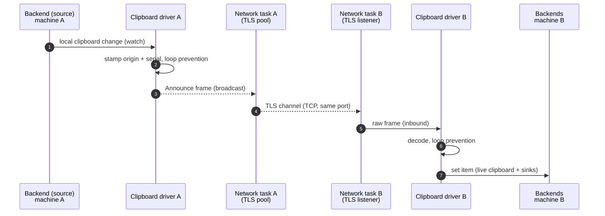
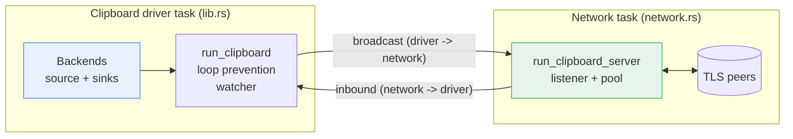
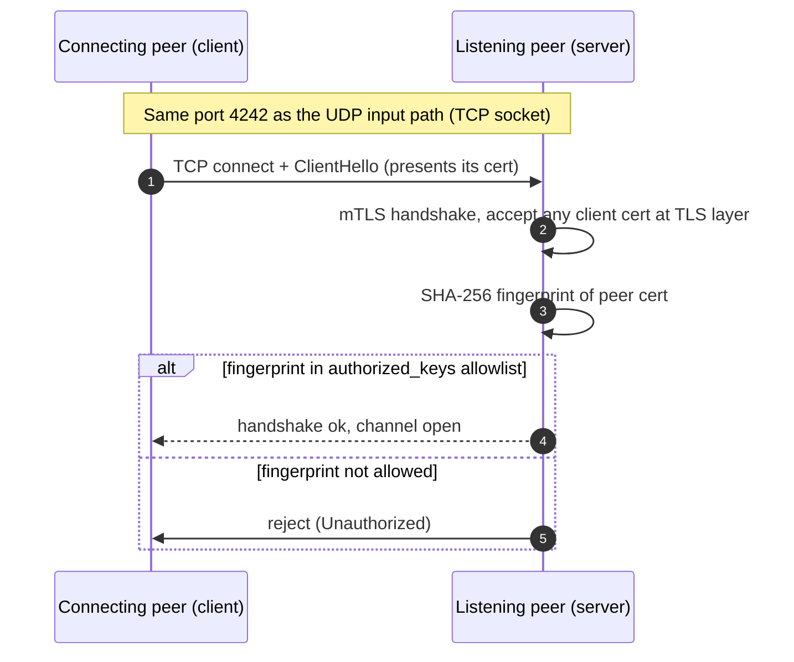
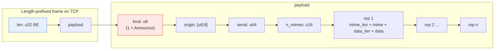
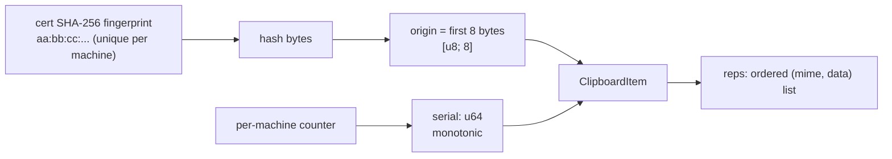
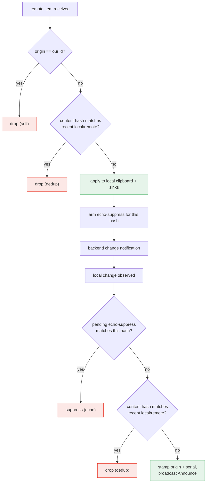
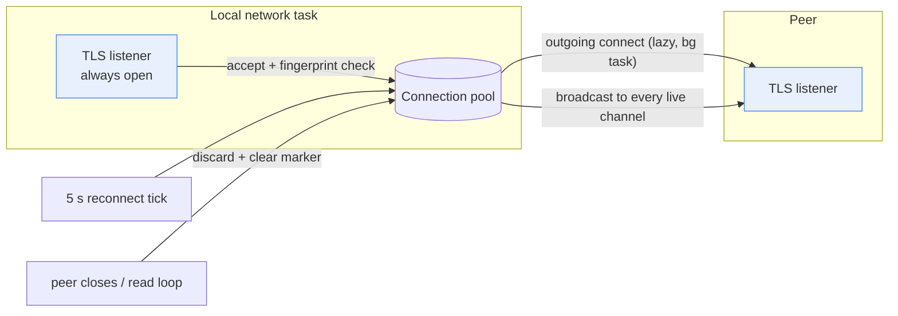
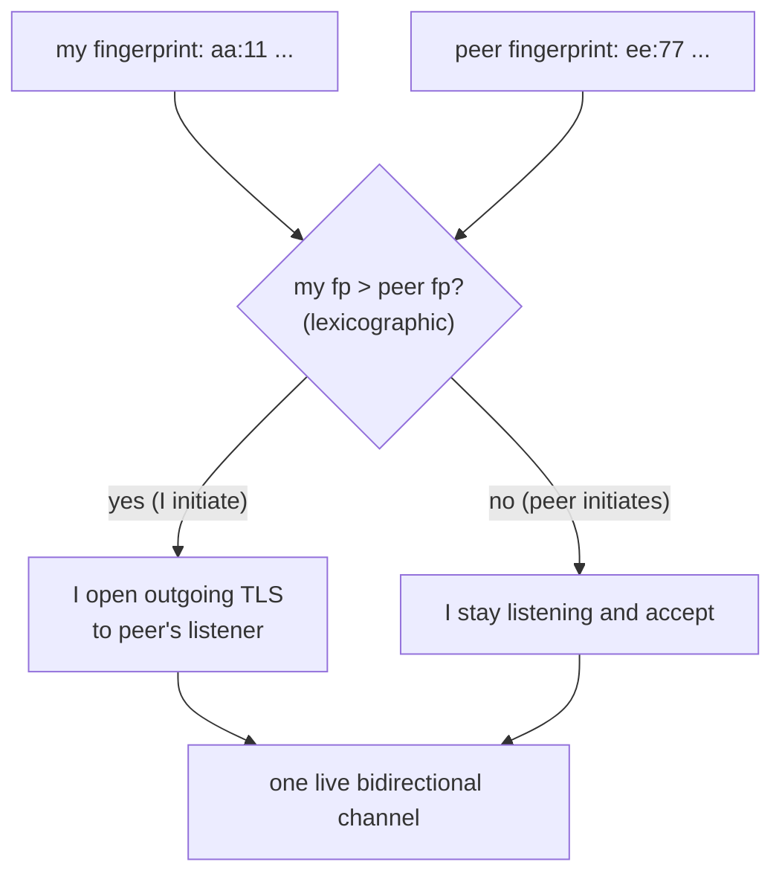
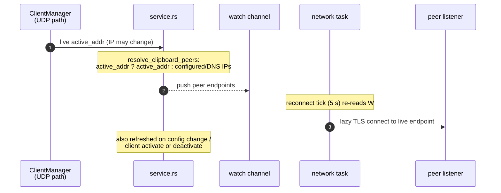
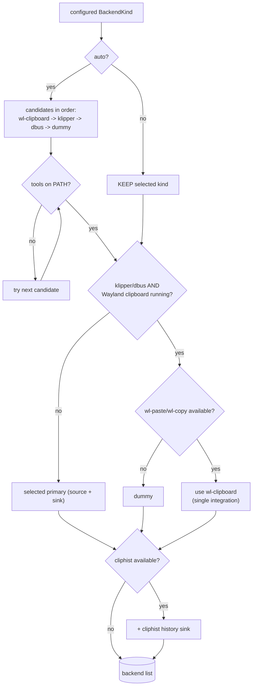

# Clipboard Sync

Lan Mouse keeps the clipboards of connected machines in sync so that copying
text on one host makes it available to paste on another.

> This is our own implementation, added on top of the original Lan Mouse
> project (see the notice at the top of [README.md](./README.md)).

The subsystem lives in the `lan-mouse-clipboard` crate and is integrated by the
main binary (`src/service.rs`). It is **separate from the input path**: while
mouse/keyboard events travel over the fixed-size UDP/DTLS `lan-mouse-proto`
channel, clipboard data uses its own TCP/TLS channel on the *same* port.

This document describes the architecture, transport, wire protocol, loop
prevention, connection handling, and backends.

## Table of contents

- [High-level flow](#high-level-flow)
- [Two tasks](#two-tasks)
- [Transport](#transport)
- [Wire protocol](#wire-protocol)
- [Item model](#item-model)
- [Loop prevention](#loop-prevention)
- [Connections](#connections)
- [Live peer resolution](#live-peer-resolution)
- [Backends](#backends)
- [Configuration & enabling](#configuration--enabling)

## High-level flow



## Two tasks

The subsystem is split into two spawned tasks, mirroring how the capture and
emulation subsystems run:

- **The clipboard driver** (`lib.rs`, `run_clipboard`) owns the backend(s),
  the local clipboard watcher, and loop prevention. It receives decoded frames
  from the network task and produces broadcast frames for it. It also handles
  enable/disable requests and emits `Enabled` / `Disabled` events for the
  frontend.
- **The network task** (`network.rs`, `run_clipboard_server`) owns the TLS
  listener and the connection pool. It moves raw, encoded frames between peers
  and the driver: inbound frames are forwarded to the driver, and driver
  broadcast frames are written to every live connection.

The two tasks communicate over channels:

- `inbound` (network -> driver): raw frames received from peers.
- `broadcast` (driver -> network): raw frames to send to all peers.



## Transport

Clipboard sync runs on a dedicated **TCP/TLS channel on the same port as the
UDP input path** (default `4242`). TCP and UDP sockets can share a port number,
so the input channel is untouched and the fixed-size UDP/DTLS protocol does not
need to change.

Security mirrors the existing lan-mouse model:

- The **listening** side requires a client certificate (mutual TLS) and, after
  the handshake, verifies the peer certificate's SHA-256 fingerprint against
  the same `authorized_keys` / `authorized_fingerprints` allowlist that gates
  UDP input connections.
- The **connecting** side presents its certificate but does not verify the
  peer's self-signed certificate; authorization is enforced where the
  connection is accepted (the peer's listener).

The certificate + private key bundle is the existing lan-mouse cert file (the
one used by the DTLS transport). `transport::load_identity` tolerates the
non-standard `PRIVATE_KEY` label lan-mouse writes for PKCS8 EC keys by
normalizing it to `PRIVATE KEY`.



## Wire protocol

Messages are **length-prefixed and big-endian**, carried over an ordered,
reliable TCP stream, so there is no chunking, sequencing, or acknowledgement
logic on the wire. Each frame is:

```
[len: u32 BE][payload]
```

`payload` is `[kind: u8][fields...]`. There is one message kind today:

- `Announce (kind = 1)`: share a single clipboard item.



`Announce` fields:

```
origin:  [u8; 8]
serial:  u64
n_mimes: u16
for each representation:
  mime_len: u16
  mime:     UTF-8 bytes
  data_len: u32
  data:     raw bytes
```

The maximum total item size is `DEFAULT_MAX_ITEM_SIZE` (64 MiB), and a decoded
payload is capped at that plus a small header margin. `FrameReader` accumulates
raw stream bytes and splits them back into complete payloads, handling frames
that span multiple reads as well as several frames within one read. Malformed
lengths are rejected and the reader resynchronizes on the next length prefix.

## Item model

A clipboard item is one copied piece of content with one or more MIME
representations:

- `origin`: 8-byte id of the machine that created the item.
- `serial`: monotonic, per-machine counter incremented for each
  locally-originated item.
- `reps`: ordered list of `(mime, data)`, sender-preferred MIME first.

`origin` is derived from the local certificate fingerprint
(`origin_from_fingerprint`, the first 8 bytes of its SHA-256). Because the
fingerprint is already the per-machine identity that gates connection
authorization, it is a stable identity source.



The wire format is MIME-agnostic. The current backends handle **plain text**
(`text/plain;charset=utf-8`); other MIME types (e.g. images) are an additive
extension.

## Loop prevention

Because setting a remote item on the local clipboard makes the local backend
fire its own change notification, without safeguards two machines would bounce
an item back and forth forever. `LoopPrevention` (`dedup.rs`) combines several
rules:

- **Self-origin rejection**: an item whose `origin` equals this machine's own id
  is never applied or re-broadcast.
- **Content-hash dedup**: an item whose content hash matches the last seen
  remote or local item is dropped, so two machines copying identical content do
  not ping-pong it.
- **Echo suppression**: when a remote item is applied, a "pending suppress" is
  armed so the backend's change notification for that exact content is not
  re-broadcast.
- **Serial monotonicity**: locally-originated items carry an increasing `serial`
  so they are globally identifiable.

The decision flow for a received remote item and for a locally-observed change
is:



## Connections

The network task keeps a pool of live TLS connections (`ConnectionRegistry`).
Its design:

- **One live channel per peer** is enough for bidirectional sync; broadcast
  frames are written to every live channel.
- The **listener is always open** for incoming peers and is never idle-evicted.
- For configured peers, the task **lazily establishes an outgoing connection**
  in a background task (so connect attempts never block the accept loop, which
  would otherwise deadlock two peers connecting to each other). It re-attempts
  on a 5-second reconnect tick.
- **Idle eviction**: outgoing connections are evicted after 60 seconds of
  inactivity; incoming connections are not. Eviction is only attempted when a
  broadcast happens.
- **Failure handling**: when a peer closes its side, its read loop notifies the
  network task, which drops the stale channel and clears the "connected" marker
  so the reconnect tick re-establishes it. This prevents getting stuck in
  CLOSE-WAIT holding a stale write half.



### Who initiates

To avoid two peers each connecting to the other and keeping a different half of
the pair, only the machine with the **lexicographically larger certificate
fingerprint** initiates the outgoing connection; the other side just accepts.
One live bidirectional channel results.



## Live peer resolution

The peer addresses the clipboard connects out to are **not** read straight from
the static `clients[].ips` in `config.toml`. A stale IP (for example after DHCP
hands out a new lease) used to leave the clipboard TCP connection stuck in
SYN-SENT while the UDP input path still worked via the live address.

Instead, `service.rs` resolves clipboard peers from the **live UDP-path
address** of each peer (`ClientManager.active_addr`) when available, and only
falls back to the configured/DNS IPs when none is known yet. The result is
pushed to the network task through a `watch` channel:

- It is seeded at startup and refreshed whenever the config changes, a client is
  activated/deactivated, or a connection is established.
- The network task re-reads the channel on every 5-second reconnect tick, so
  peer addresses (and their live IPs) can change without a restart.



## Backends

A backend is either a **source** (reads and watches the live clipboard) or a
**sink** (only writes, e.g. recording into a history store), or both. The driver
treats the first backend as the source and calls `set` on every backend.

Backends are selected through `BackendKind`:

| Kind         | Role        | Notes                                                        |
|--------------|-------------|--------------------------------------------------------------|
| `auto`       | (resolved)  | Picks the best available candidate automatically.            |
| `wl-clipboard`| source+sink | Shells out to `wl-paste` / `wl-copy`; covers Noctalia v5 and similar. Handles plain text in v1. |
| `cliphist`   | sink only   | Pipes received items into `cliphist store` to record history; never a change source. |
| `klipper`    | source+sink | KDE clipboard via DBus (`dbus-send`).                        |
| `dbus`       | source+sink | Generic DBus clipboard integration.                          |
| `dummy`      | fallback    | In-memory backend used for testing and as a safe fallback.   |

Resolution (`build_backends`):

- With `auto`, candidates are tried in priority order (`wl-clipboard` ->
  `klipper` -> `dbus` -> `dummy`), skipping ones whose tools are not on `PATH`.
- **Single integration rule**: only one clipboard manager may run at a time.
  If a Wayland or Noctalia clipboard manager is already running (detected by
  scanning `/proc` for names like `wl-paste`, `wl-copy`, `cliphist`, `copyq`,
  `noctalia`, etc.), the DBus (klipper) integration is disabled so two managers
  do not fight over the clipboard. In that case a DBus request falls back to the
  `wl-clipboard` backend, else to `dummy`.
- A `cliphist` history sink is attached whenever `cliphist` is available and not
  already the primary.



## Configuration & enabling

Clipboard sync is configured in `config.toml` under a `clipboard` table:

```toml
[clipboard]
# enable clipboard sync
enabled = true
# backend: "auto" | "wl-clipboard" | "cliphist" | "klipper" | "dbus"
backend = "auto"
```

It can be toggled at runtime from the GTK frontend or the CLI. Enabling/disabling
is routed to the driver (`SetEnabled`), which starts or stops the local
clipboard watcher, and the frontend is notified via `Enabled` / `Disabled`
events. The choice is persisted back into the config file.

No extra ports or firewall rules are needed beyond the ones lan-mouse already
uses, because the clipboard channel shares the same UDP/TCP port.
