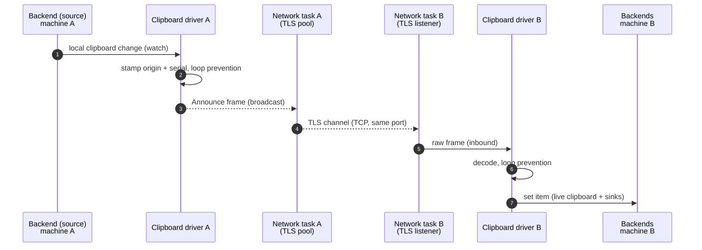
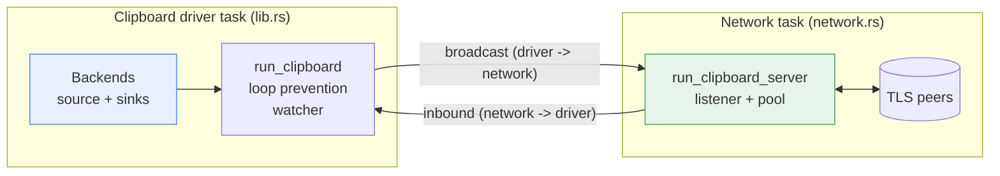
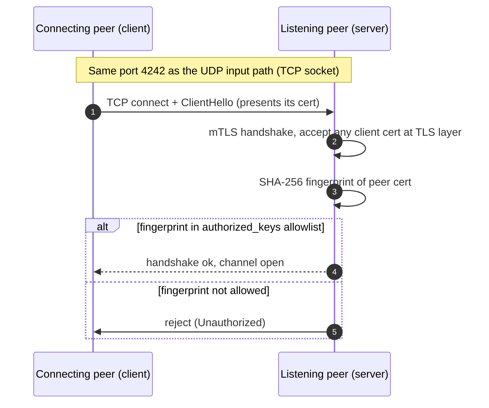
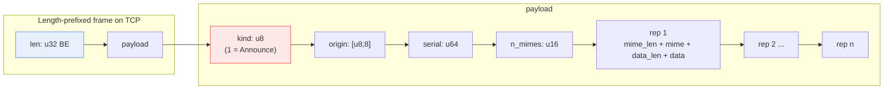
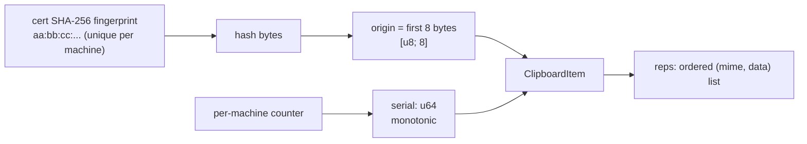
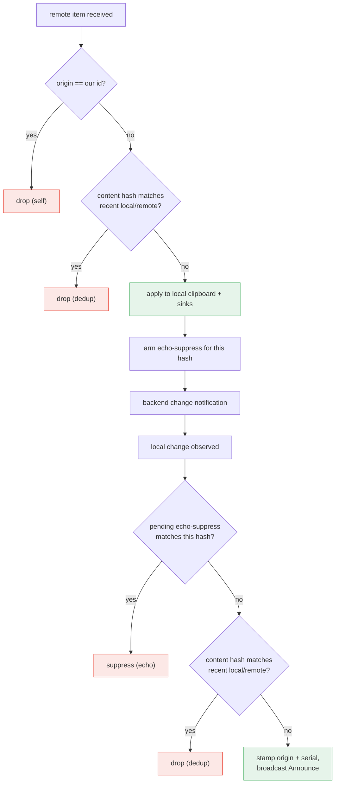
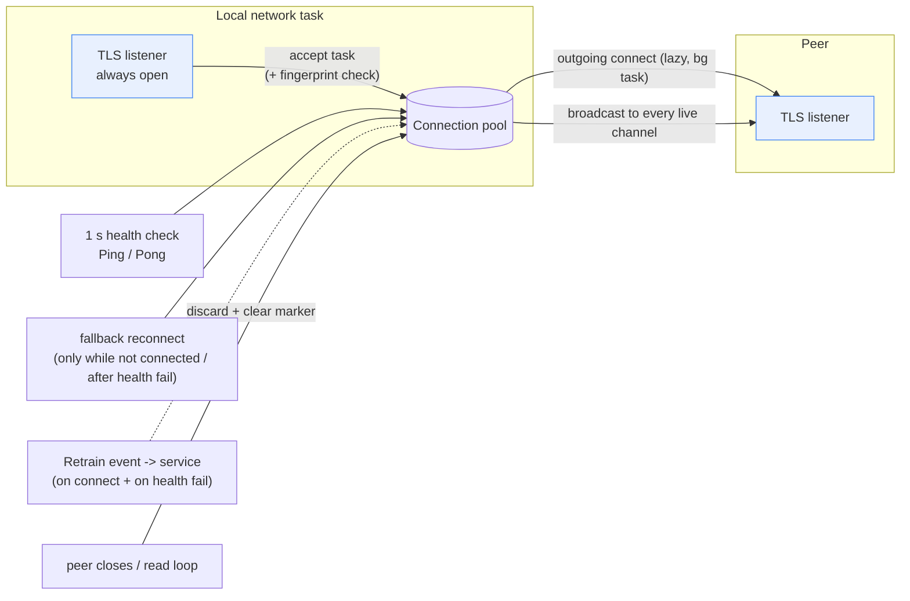
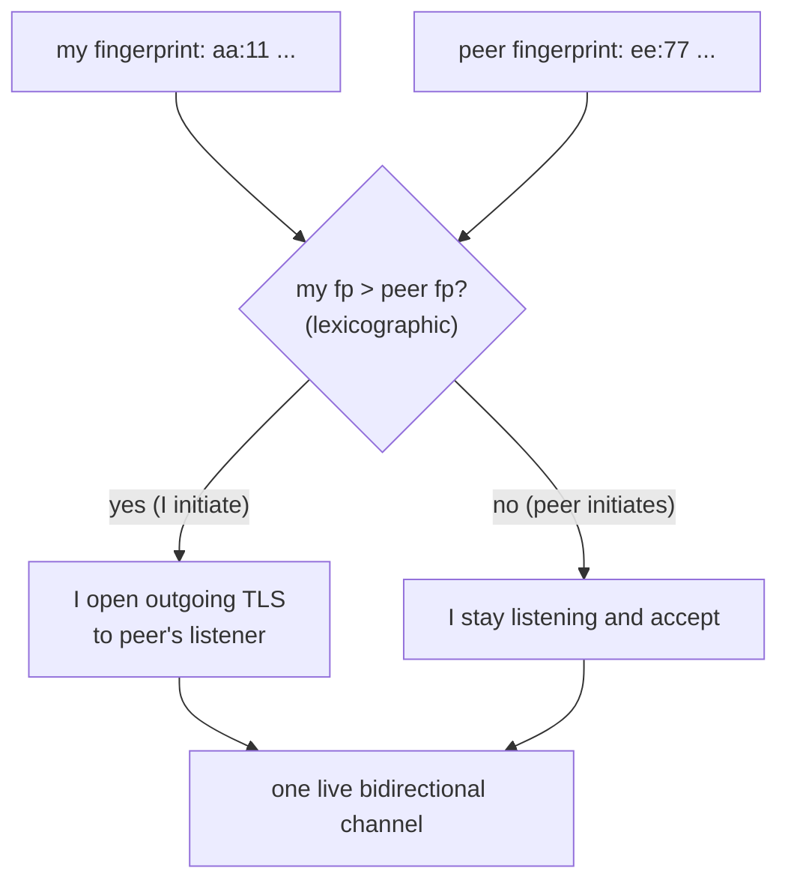
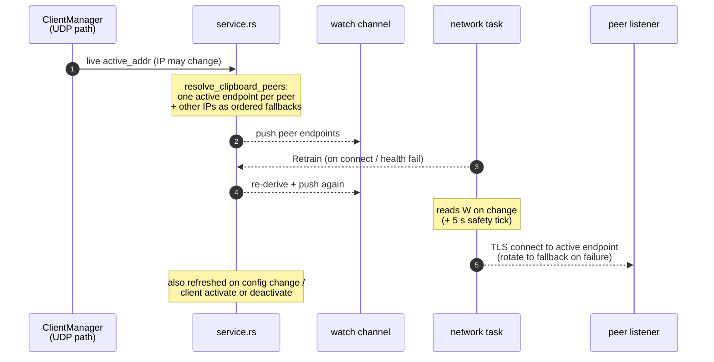
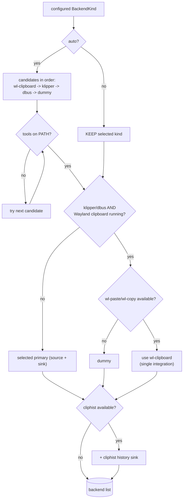

# Clipboard Sync

Lan Mouse keeps the clipboards of connected machines in sync so that copying
on one host makes it available to paste on another. Text and images are
supported; the wire is MIME-agnostic, so other content travels unchanged too.

> This is our own implementation, added on top of the original Lan Mouse
> project (see the notice at the top of [README.md](./README.md)).

The subsystem lives in the `lan-mouse-clipboard` crate and is integrated by the
main binary (`src/service.rs`). It is **separate from the input path**: while
mouse/keyboard events travel over the fixed-size UDP/DTLS `lan-mouse-proto`
channel, clipboard data uses its own TCP/TLS channel on the *same* port.

This document describes the architecture, transport, wire protocol, loop
prevention, connection handling, and backends.

## Table of contents

- [High-level flow](#high-level-flow)
- [Two tasks](#two-tasks)
- [Transport](#transport)
- [Wire protocol](#wire-protocol)
- [Item model](#item-model)
- [Loop prevention](#loop-prevention)
- [Connections](#connections)
- [Live peer resolution](#live-peer-resolution)
- [Backends](#backends)
- [Configuration & enabling](#configuration--enabling)

## High-level flow



## Two tasks

The subsystem is split into two spawned tasks, mirroring how the capture and
emulation subsystems run:

- **The clipboard driver** (`lib.rs`, `run_clipboard`) owns the backend(s),
  the local clipboard watcher, and loop prevention. It receives decoded frames
  from the network task and produces broadcast frames for it. It also handles
  enable/disable requests and emits `Enabled` / `Disabled` events for the
  frontend.
- **The network task** (`network.rs`, `run_clipboard_server`) owns the TLS
  listener and the connection pool. It moves raw, encoded frames between peers
  and the driver: inbound frames are forwarded to the driver, and driver
  broadcast frames are written to every live connection.

The two tasks communicate over channels:

- `inbound` (network -> driver): raw frames received from peers.
- `broadcast` (driver -> network): raw frames to send to all peers.



## Transport

Clipboard sync runs on a dedicated **TCP/TLS channel on the same port as the
UDP input path** (default `4242`). TCP and UDP sockets can share a port number,
so the input channel is untouched and the fixed-size UDP/DTLS protocol does not
need to change.

Security mirrors the existing lan-mouse model:

- The **listening** side requires a client certificate (mutual TLS) and, after
  the handshake, verifies the peer certificate's SHA-256 fingerprint against
  the same `authorized_keys` / `authorized_fingerprints` allowlist that gates
  UDP input connections.
- The **connecting** side presents its certificate but does not verify the
  peer's self-signed certificate; authorization is enforced where the
  connection is accepted (the peer's listener).

The certificate + private key bundle is the existing lan-mouse cert file (the
one used by the DTLS transport). `transport::load_identity` tolerates the
non-standard `PRIVATE_KEY` label lan-mouse writes for PKCS8 EC keys by
normalizing it to `PRIVATE KEY`.



## Wire protocol

Messages are **length-prefixed and big-endian**, carried over an ordered,
reliable TCP stream, so there is no chunking, sequencing, or acknowledgement
logic on the wire. Each frame is:

```
[len: u32 BE][payload]
```

`payload` is `[kind: u8][fields...]`. The message kinds are:

- `Announce (kind = 1)`: share a single clipboard item.
- `Ping (kind = 2)`: liveness probe (health check).
- `Pong (kind = 3)`: reply to a `Ping`.



`Announce` fields:

```
origin:  [u8; 8]
serial:  u64
n_mimes: u16
for each representation:
  mime_len: u16
  mime:     UTF-8 bytes
  data_len: u32
  data:     raw bytes
```

The maximum total item size is `max_item_size` (default
`DEFAULT_MAX_ITEM_SIZE`, 64 MiB), and a decoded payload is capped at that plus
a framing margin. `FrameReader` accumulates raw stream bytes and splits them
back into complete payloads, handling frames that span multiple reads as well
as several frames within one read. Malformed lengths are rejected and the
reader resynchronizes on the next length prefix.

## Item model

A clipboard item is one copied piece of content with one or more MIME
representations:

- `origin`: 8-byte id of the machine that created the item.
- `serial`: monotonic, per-machine counter incremented for each
  locally-originated item.
- `reps`: ordered list of `(mime, data)`, sender-preferred MIME first.

`origin` is derived from the local certificate fingerprint
(`origin_from_fingerprint`, the first 8 bytes of its SHA-256). Because the
fingerprint is already the per-machine identity that gates connection
authorization, it is a stable identity source.



### Representations and images

The wire format is MIME-agnostic, so images (and any other binary content)
travel the same way as text: each representation is just a MIME type and its
bytes. A local selection can offer several types at once (a browser image
offers `image/png` alongside `text/html` and `text/plain`); the reading
backend collects the useful ones, in the order the selection lists them, and
the wire carries the resulting ordered list.

Reads are deliberately limited. Reading a type forces the clipboard owner to
produce it on demand, and some owners - Qt in particular - advertise a large
converter matrix (every image format their encoders support, e.g. `image/heic`,
`image/eps`, `image/exr`, `image/jxl`, plus `application/x-qt-image`). Asking
for all of them makes the owner re-encode the image dozens of times on its UI
thread, which can stall the application that owns the clipboard. Instead the
backend reads:

- **all text types** (`text/*`, plus the legacy X11 string targets); and
- **one image type**: the best-ranked format offered, by preference
  `image/png` > `image/webp` > `image/jpeg`/`image/jpg` > `image/bmp` >
  `image/tiff` > any other `image/*`.

Format aliases are collapsed (`image/jpg`/`image/jfif` -> `image/jpeg`,
`image/tif` -> `image/tiff`), and private types such as
`application/x-qt-image` are never read. Keeping the offered relative order
means the sender's own preference still decides the primary representation.

The **first representation is the primary**. It matters because a receiving
backend can usually advertise only one MIME type at a time (`wl-copy` sets a
single `--type`), so the receiver applies the primary representation and
drops the rest:

- The primary is chosen by the *sender*, following the order the selection
  itself reports. `wl-paste --list-types` is the authority, so the source
  application's own preference wins among the types we read.
- Protocol targets that are not data (`TARGETS`, `MULTIPLE`, `TIMESTAMP`,
  `SAVE_TARGETS`, ...) are filtered out, as are the legacy X11 string aliases
  (`UTF8_STRING`, `STRING`, `TEXT`) whenever at least one real MIME type is
  offered.
- Reading is binary-safe: `wl-paste --no-newline` is used for every type so
  bytes (including image headers) are never altered.
- Loop prevention hashes the **primary** representation only. The receiver's
  echo carries just the primary, so hashing it the same way keeps the
  broadcast and its echo identical and echo suppression correct.

Sizes are bounded by `max_item_size` (see
[Configuration & enabling](#configuration--enabling)): representations are
added in order until the cap is reached, and an item whose primary
representation alone exceeds the cap is dropped with a warning.

## Loop prevention

Because setting a remote item on the local clipboard makes the local backend
fire its own change notification, without safeguards two machines would bounce
an item back and forth forever. `LoopPrevention` (`dedup.rs`) combines several
rules:

- **Self-origin rejection**: an item whose `origin` equals this machine's own id
  is never applied or re-broadcast.
- **Content-hash dedup**: an item whose content hash matches the last seen
  remote or local item is dropped, so two machines copying identical content do
  not ping-pong it.
- **Echo suppression**: when a remote item is applied, a "pending suppress" is
  armed so the backend's change notification for that exact content is not
  re-broadcast.
- **Serial monotonicity**: locally-originated items carry an increasing `serial`
  so they are globally identifiable.

The decision flow for a received remote item and for a locally-observed change
is:



## Connections

The network task keeps a pool of live TLS connections (`ConnectionRegistry`).
Its design:

- **One live channel per peer** is enough for bidirectional sync; broadcast
  frames are written to every live channel.
- The **listener is always open** for incoming peers and is never idle-evicted.
  Accepting runs in its own task, *not* inside the network loop's `select!`, so
  a timer winning the race can never cancel a TLS handshake mid-flight and drop
  the connection.
- For configured peers, the task **lazily establishes an outgoing connection**
  in a background task (so connect attempts never block). At most one dial per
  peer is in flight at a time.
- **Health check**: every second the task sends a `Ping` on each live channel
  and expects a `Pong`; a peer with no `Pong` within 3 seconds is considered
  dead, is dropped, and triggers IP re-training.
- **Reconnect is the fallback**: outgoing connections are re-attempted only
  while a known peer has no live channel (initial connect) or immediately after
  a health check fails — there is no blind periodic reconnect while healthy.
- **Idle eviction**: outgoing connections are evicted after 60 seconds of
  inactivity; incoming connections are not. Eviction is only attempted when a
  broadcast happens.
- **Failure handling**: when a peer closes its side, its read loop notifies the
  network task, which drops the stale channel and clears the "connected" marker
  so the fallback reconnect re-establishes it. This prevents getting stuck in
  CLOSE-WAIT holding a stale write half.
- **IP re-training**: every new connection (either direction) and every health
  failure raises a `Retrain` event, prompting the service to re-derive peer
  addresses from the live UDP path.



### Who initiates

To avoid two peers each connecting to the other and keeping a different half of
the pair, only the machine with the **lexicographically larger certificate
fingerprint** initiates the outgoing connection; the other side just accepts.
One live bidirectional channel results.



## Live peer resolution

The peer addresses the clipboard connects out to are **not** read straight from
the static `clients[].ips` in `config.toml`. A stale IP (for example after DHCP
hands out a new lease) used to leave the clipboard TCP connection stuck in
SYN-SENT while the UDP input path still worked via the live address.

Instead, `service.rs` resolves clipboard peers from the **live UDP-path
address** of each peer (`ClientManager.active_addr`) when available. Each peer
gets **exactly one active endpoint**; every other registered IP is kept as an
ordered **fallback** (not dialed while the active endpoint is live). The result
is pushed to the network task through a `watch` channel:

- It is seeded at startup and refreshed whenever the config changes, a client is
  activated/deactivated, or a `Retrain` event arrives from the network task
  (raised on every new connection and on every health-check failure). The
  service also re-derives it on a 5-second safety tick.
- The network task re-reads the channel whenever it changes, so peer addresses
  (and their live IPs) can change without a restart.
- Only **one live channel per peer** is kept. The network task dials the peer's
  active endpoint first; if that dial fails it rotates to the next fallback, and
  it prunes redundant/stale channels (a second outgoing channel to the same
  peer, or a duplicate incoming channel from the same peer IP) so the old
  "dial every resolved IP" duplicates cannot persist.



## Backends

A backend is either a **source** (reads and watches the live clipboard) or a
**sink** (only writes, e.g. recording into a history store), or both. The driver
treats the first backend as the source and calls `set` on every backend.

Backends are selected through `BackendKind`:

| Kind         | Role        | Notes                                                        |
|--------------|-------------|--------------------------------------------------------------|
| `auto`       | (resolved)  | Picks the best available candidate automatically.            |
| `wl-clipboard`| source+sink | Shells out to `wl-paste` / `wl-copy`; covers Noctalia v5 and similar. Reads supported text/image types (skips expensive converter formats); writes the primary representation. |
| `cliphist`   | sink only   | Pipes received items into `cliphist store` to record history; never a change source. Stores the primary representation's MIME. |
| `klipper`    | source+sink | KDE clipboard via DBus (`dbus-send`). Text only; rich items are skipped. |
| `dbus`       | source+sink | Generic DBus clipboard integration. Text only.              |
| `dummy`      | fallback    | In-memory backend used for testing and as a safe fallback.    |

Resolution (`build_backends`):

- With `auto`, candidates are tried in priority order (`wl-clipboard` ->
  `klipper` -> `dbus` -> `dummy`), skipping ones whose tools are not on `PATH`.
- **Single integration rule**: only one clipboard manager may run at a time.
  If a Wayland or Noctalia clipboard manager is already running (detected by
  scanning `/proc` for names like `wl-paste`, `wl-copy`, `cliphist`, `copyq`,
  `noctalia`, etc.), the DBus (klipper) integration is disabled so two managers
  do not fight over the clipboard. In that case a DBus request falls back to the
  `wl-clipboard` backend, else to `dummy`.
- A `cliphist` history sink is attached whenever `cliphist` is available and not
  already the primary.



## Configuration & enabling

Clipboard sync is configured in `config.toml` under a `clipboard` table:

```toml
[clipboard]
# enable clipboard sync
enabled = true
# backend: "auto" | "wl-clipboard" | "cliphist" | "klipper" | "dbus"
backend = "auto"
# total size cap for a single item (all representations combined), in bytes
# default 64 MiB; clamped to [1 KiB, 256 MiB]
max_item_size = 67108864
```

It can be toggled at runtime from the GTK frontend or the CLI. Enabling/disabling
is routed to the driver (`SetEnabled`), which starts or stops the local
clipboard watcher, and the frontend is notified via `Enabled` / `Disabled`
events. The choice is persisted back into the config file.

`max_item_size` bounds both directions on the host that sets it: it caps what
the local backend reads and encodes, and it caps the payload the network task
accepts. There is no negotiation, so **set the same value on every host**;
a peer configured larger can send items a smaller peer rejects. The clamped
range is `[1 KiB, 256 MiB]`.

No extra ports or firewall rules are needed beyond the ones lan-mouse already
uses, because the clipboard channel shares the same UDP/TCP port.
